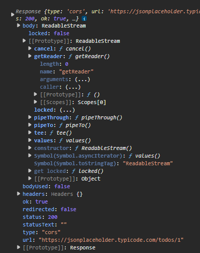

Yes! Since the data is inside the **ReadableStream**, you need to read it using methods like `.json()`, `.text()`, or manually processing the stream.

### **Alternative Ways to See the Data**
Here are different ways you can extract the data from the `Response` body:

#### **1️⃣ Using `.json()` (Best for JSON Responses)**
```js
const response = await apiCalling.json();
console.log(response); // Logs the parsed JSON object
```

#### **2️⃣ Using `.text()` (Best for Raw Text)**
If you want to see the raw response as a string:
```js
const rawText = await apiCalling.text();
console.log(rawText); // Logs raw JSON text
```

#### **3️⃣ Using `.blob()` (For Binary Data)**
If the response contains an image or file:
```js
const blobData = await apiCalling.blob();
console.log(blobData); // Logs Blob object (not human-readable)
```

#### **4️⃣ Using `.arrayBuffer()` (For Low-Level Binary Data)**
For advanced cases where you need to work with raw bytes:
```js
const buffer = await apiCalling.arrayBuffer();
console.log(new Uint8Array(buffer)); // Logs byte array
```

### **Manually Reading the Stream (Advanced)**
Since the `body` is a ReadableStream, you can manually read it:
```js
const reader = apiCalling.body.getReader();
const { value, done } = await reader.read();
console.log(new TextDecoder().decode(value)); // Converts bytes to a readable string
```
---
### **Which One Should You Use?**
- ✅ **Use `.json()`** if the API returns JSON data.
- ✅ **Use `.text()`** if you want to see raw data.
- ✅ **Use `.blob()` or `.arrayBuffer()`** for binary data.

Since you're fetching from `jsonplaceholder.typicode.com`, `.json()` is the best choice. Let me know if you want to explore streams more! 🚀